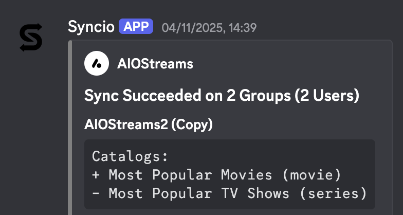

# Syncio API Documentation

## Base URL
All API endpoints are prefixed with `/api/ext` (e.g., `/api/ext/account`, `/api/ext/addons/reload`).

## Authentication

**API key authentication required for all endpoints.**

- API key sent via `Authorization: Bearer <api-key>` header
- API key can be generated in the Settings page
- Example: `Authorization: Bearer 415x1e...`

---

## Endpoints

### External API (`/api/ext`)

#### `GET /api/ext/account`
Get account statistics.

**Authentication:** Required (API key)

**Response:**
```json
{
  "lastRunAt": "1337-01-01T00:00:00Z",
  "usersCount": 10,
  "groupsCount": 5,
  "addonsCount": 20
}
```

#### `POST /api/ext/addons/reload`
Reload addons by Stremio addon ID. This can be used by other addon developers so whenever the addon is updated, a call to Syncio is made to immediately reload it.

**Authentication:** Required (API key)

**Request Body:**
```json
{
  "stremioAddonId": "com.stremio.addon.id"
}
```

**Response:**
```json
{
  "message": "Addons reloaded",
  "reloaded": 2,
  "total": 2,
  "diffs": [
    {
      "id": "addon-id",
      "name": "Addon Name",
      "diffs": {
        "addedResources": [...],
        "removedResources": [...],
        "addedCatalogs": [...],
        "removedCatalogs": [...]
      }
    }
  ]
}
```

#### `POST /api/ext/addons/sync`
Reload addons by Stremio addon ID, then sync all groups containing those addons. This can be implemented by other addon developers to enable instant addon configuration update propagation on save to multiple users.

**Authentication:** Required (API key)

**Request Headers (Optional):**
- `Source` or `X-Sync-Source` or `X-App-Name`: Source label for Discord notifications (e.g., "Addon Builder", "My App")
- `Source-Logo` or `X-Source-Logo`: Logo URL for Discord notifications

**Request Body:**
```json
{
  "stremioAddonId": "com.stremio.addon.id"
}
```

**Response:**
```json
{
  "message": "Addons reloaded and groups synced",
  "reloaded": 2,
  "syncedGroups": 3
}
```



#### `POST /api/ext/groups/sync`
Sync all groups.

**Authentication:** Required (API key)

**Request Headers (Optional):**
- `Source` or `X-Sync-Source` or `X-App-Name`: Source label for Discord notifications (e.g., "Addon Builder", "My App")
- `Source-Logo` or `X-Source-Logo`: Logo URL for Discord notifications

**Response:**
```json
{
  "message": "All groups synced",
  "syncedCount": 5
}
```

---

## Error Responses

All endpoints may return error responses in the following format:

```json
{
  "message": "Error description",
  "error": "Detailed error message (optional)"
}
```

**Common HTTP Status Codes:**
- `200` - Success
- `400` - Bad Request
- `401` - Unauthorized (invalid or missing API key)
- `404` - Not Found
- `500` - Internal Server Error

---

## Notes

- All timestamps are in ISO 8601 format
- All IDs are UUIDs
- URLs are normalized and validated
- Manifest URLs are encrypted in the database
- Sync operations respect account-level sync settings (mode: normal/advanced, safe/unsafe)
- The `stremioAddonId` parameter refers to the Stremio addon identifier (e.g., `com.stremio.addon.id`)
- When reloading addons, the system will find all addons in your account that match the given `stremioAddonId` and reload their manifests
- The `diffs` array in reload responses shows what changed in each addon's manifest (new/removed resources and catalogs)
